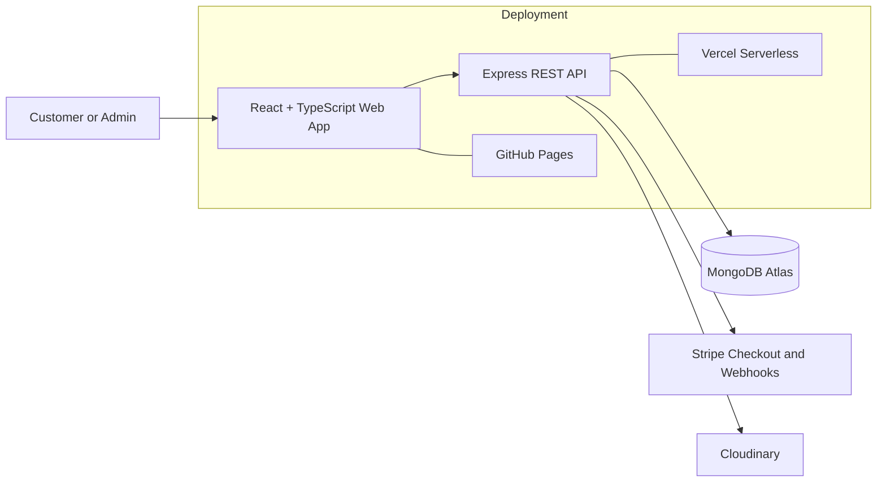

# Nook

A full-stack e-commerce platform that covers the complete customer and store-admin workflow, from product discovery and checkout to inventory, order fulfillment, and user management.

[Live Storefront](https://osamaibrhim.github.io/Nook/) · [API Health](https://nook-beryl.vercel.app/api/v1/health) · [Backend Documentation](server/README.md) · [Frontend Documentation](client/README.md)

## What Nook includes

### Customer experience

- Responsive storefront with product search, filtering, sorting, and detailed product pages
- Persistent Redux cart and protected customer routes
- Registration and login with automatic access-token refresh
- Shipping checkout flow with Stripe Checkout
- Order history, order details, payment resume, and eligible order cancellation
- Loading skeletons, empty states, offline handling, retryable errors, toast feedback, keyboard navigation, and reduced-motion support

### Store administration

- Protected admin dashboard with store statistics
- Product, category, image, inventory, order, and user management
- Controlled order-status transitions from pending through delivery
- Responsive mobile layouts for admin workflows

### Backend and security

- REST API built with Node.js, Express, MongoDB, and Mongoose
- Short-lived JWT access tokens with rotating refresh tokens stored in `httpOnly` cookies
- Customer/admin role authorization and account activation controls
- Server-priced orders and transactional stock reservation
- Stripe signature verification and idempotent webhook processing
- Cloudinary image uploads
- Helmet, CORS allow-listing, rate limiting, request-size limits, centralized error handling, and graceful shutdown

### SEO and performance

- Route-specific metadata, canonical URLs, Open Graph, and Twitter cards
- Product and breadcrumb JSON-LD
- Generated `robots.txt` and XML sitemap
- Lazy route bundles and an image-led homepage experience without a heavy 3D runtime

## Architecture



## Technology stack

| Area | Technologies |
|---|---|
| Frontend | React 19, TypeScript, Redux Toolkit, React Router, Tailwind CSS, Vite |
| Backend | Node.js 20+, Express 5, MongoDB, Mongoose |
| Authentication | JWT access tokens, rotating refresh-token cookies, bcrypt |
| Payments | Stripe Checkout, verified webhooks |
| Media | Cloudinary, Multer |
| Quality and delivery | Node test runner, Oxlint, GitHub Actions, GitHub Pages, Vercel |

## Repository structure

```text
Nook/
├── client/   # Storefront, customer account, checkout, and admin dashboard
├── server/   # REST API, authentication, catalog, orders, payments, and inventory
└── .github/  # CI and GitHub Pages deployment workflow
```

## Local development

### 1. Start the API

```bash
cd server
cp .env.example .env
npm install
npm run dev
```

The API defaults to `http://localhost:5000/api/v1`. MongoDB must support transactions; MongoDB Atlas is recommended.

### 2. Start the web app

```bash
cd client
cp .env.example .env
npm install
npm run dev
```

Set `VITE_API_URL` to the API URL and make sure the backend `CLIENT_URL` includes the frontend origin.

### 3. Add demo data

```bash
cd server
npm run seed
```

The seed script adds sample categories, products, customers, and orders. Local demo-account details are documented in [`server/README.md`](server/README.md).

## Quality checks

```bash
# Backend
cd server
npm test
npm run check

# Frontend
cd client
npm run lint
npm run build
```

GitHub Actions runs the backend tests and entry-point check, then lints and builds the frontend before deploying the storefront.

## Deployment

- **Frontend:** GitHub Pages at `https://osamaibrhim.github.io/Nook/`
- **Backend:** Vercel at `https://nook-beryl.vercel.app`
- **Database:** MongoDB Atlas or another MongoDB replica set
- **External services:** Stripe and Cloudinary

Production secrets must be configured only in the deployment platforms and must never be committed to the repository.